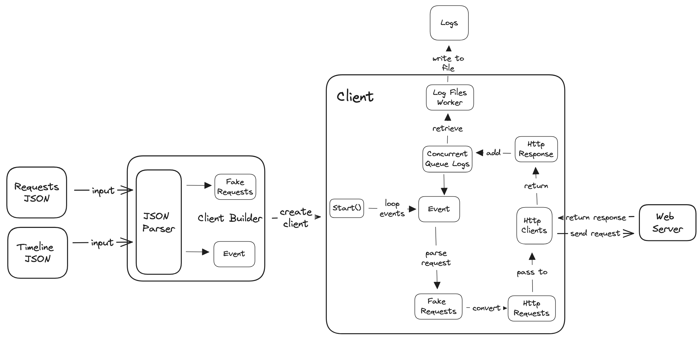

<h1>SandboxClient</h1>

The Sandbox Client is a console app that takes a JSON file as an input that can simulate various different of scenarios of incoming requests:

- A single request
- Parallel `n` requests
- Sequential `n` requests

<h2>Table of Contents</h2>

- [Architecture](#architecture)
- [ClientBuilder](#clientbuilder)
  - [FakeRequest](#fakerequest)
  - [FakeEvent](#fakeevent)
- [Client](#client)
  - [Start()](#start)
  - [HttpClient](#httpclient)
  - [LogFileWorker](#logfileworker)
    - [Concurrent Queue](#concurrent-queue)
    - [Worker Services](#worker-services)

## Architecture

These are the building blocks of the sandbox client.


## ClientBuilder

The `ClientBuilder` prepare the necessary components to create a `Client` so that it can go through the `FakeEvent` that was created from parsing the event json file (default value at `events.json`).

There are two types of input files that are required to set up the `Client`:

1. Requests JSON file
2. Events JSON file

### FakeRequest

The `FakeRequest` is instantiated from parsing the requests JSON file that is defined by the user. The request file defines the request that are going to be sent to the http server. It has the following file structure:

```json
 [
     {
       "id": "string",
       "method": "string",
       "header": {
           // ...
       },
       "body": {
           // ...
       }
     },
     {
       "id": "string",
       "method": "string",
       "url": "string", // if URL is not set, then it will send to default URL that is configured in appsettings.json
       "header": {
           // ...
       },
       "body": {
           // ...
       }
     },
     ///...
 ]
```

### FakeEvent

The second JSON file that is required is the **events** file that defines the events that are happening during the simulation. It instantiates the `FakeEvent` class.

It defines which and when the requests are being sent over to the designated web server.It has the following structure:

```json
 [ // sends the following requests sequentially
     "1", // sends one request
     ["2", "2", "2"], // this sends the identified requests in parallel
     { // same as above but more compact syntax
         "id": "2",
         "amount": 3,
     },
     [ // same all the requests within the array in parallel
         {
             "id": "1",
             "amount": 2
         },
         "2",
         "3"
     ]
 ]
```

These are the following rules that must be followed within the events input JSON file:

1. There are altogether three types of elements: `string`, `array`, and an `object`.
2. The `string` represents the ID of the request defined in the request input JSON file.
3. Each element in the outer array represents event and is executed sequentially in order. So in the example above, the request with id `"1"` will be sent first.
4. A nested `array` represents a parallel event such that the requests within that array will be sent to the web server in parallel.
5. The `object` represents one request that will be sent in parallel with the defined amount of that request that will be sent.

## Client

Within `Client`, there is a `HttpClient` that is used for sending requests to the designated endpoints either on the `baseUrl` or the endpoint sets in the requests.

### Start()

- **`void` vs `Task` return type from async function**
Async methods that have `void` return type can't be awaited and run independently. Whereas, an async method that returns a `Task` enables you to use `await` when calling the method. `await` allows the system to free up the running thread while the task completes, and then resume once the work is done.

### HttpClient

- **How many threads are in the thread pools?**

There are two types of threads that is managed by `System.Threading.ThreadPool`: **worker threads** and **completion port threads**. These are the differences between the two:

1. **Worker Threads:**

These are the regular threads that perform generic tasks. When you queue a work item using `ThreadPool.QueueUserWorkItem` or start a new task (`Task.Factory.StartNew` or new `Task(...).Start()`), these tasks are serviced by ThreadPool's worker threads.

2. **Completion Port Threads (I/O Threads)**

I/O completion threads are used to service I/O bound work, for example, asynchronous file I/O or network I/O.When the ThreadPool performs asynchronous I/O, it uses ThreadPool I/O completion ports, enabling minimal CPU usage while waiting for multiple I/O operations (like reads and writes) to complete.

- **How does the connection pool work in `HttpClient`?**

Every time `HttpClient` sends a request to a server, it doesn't necessarily create a new csocket connection every time. The pool is created for each unique "endpoint" (e.g. `"scheme://hostname:port"`, such as `"http://example.com:80"`). It depends on the following situation:

When an HttpClient instance sends a request:

1. If an idle connection exists in the pool, it's reused for the new request.
2. If all connections are busy and the maximum limit (MaxConnectionsPerServer) is not yet reached, a new connection is established.
3. If all connections are busy and the maximum limit is reached, the request is queued until a connection becomes idle.

This connection pooling improves performance by reusing existing connections, reducing the overhead of establishing new connections for each request.

- **Connection Pool vs Completion Port Threads?**

The `MaxConnectionsPerServer` and the number of completion port threads serve diffferent purposes. The `MaxConnectionPerServer` sets the maxmimum number of possible active socket connections to one endpint. The completion port threads are used to determines how many I/O-bound operations can be processed simultaneously.

When you call an asynchronous operation on `HttpClient`, such as `SendAsync`, it starts the operation, and if it cannot complete immediately, it will return a `Task` which represents the ongoing operation. The operations are handled at the system level and when it's completed, that's when the ThreadPool comes into play:

1. HttpClient sends a request.
2. .NET runtime notifies the OS to make a network call.
3. The OS makes the network call, while the .NET runtime is free to perform other tasks.
4. Once the network call is completed, the OS informs the .NET runtime.
5. A completion port thread (from the ThreadPool) runs the continuation of the Task (the code after the await).

### LogFileWorker

For logging the responses from the request being sent. It is a worker service that is being run in the background. It opens a `StreamWriter` and keep the socket open until the client finishes sending all the requests.

#### Concurrent Queue

#### Worker Services
